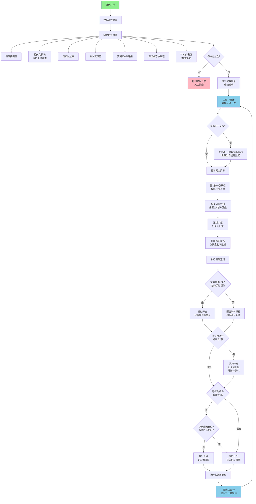
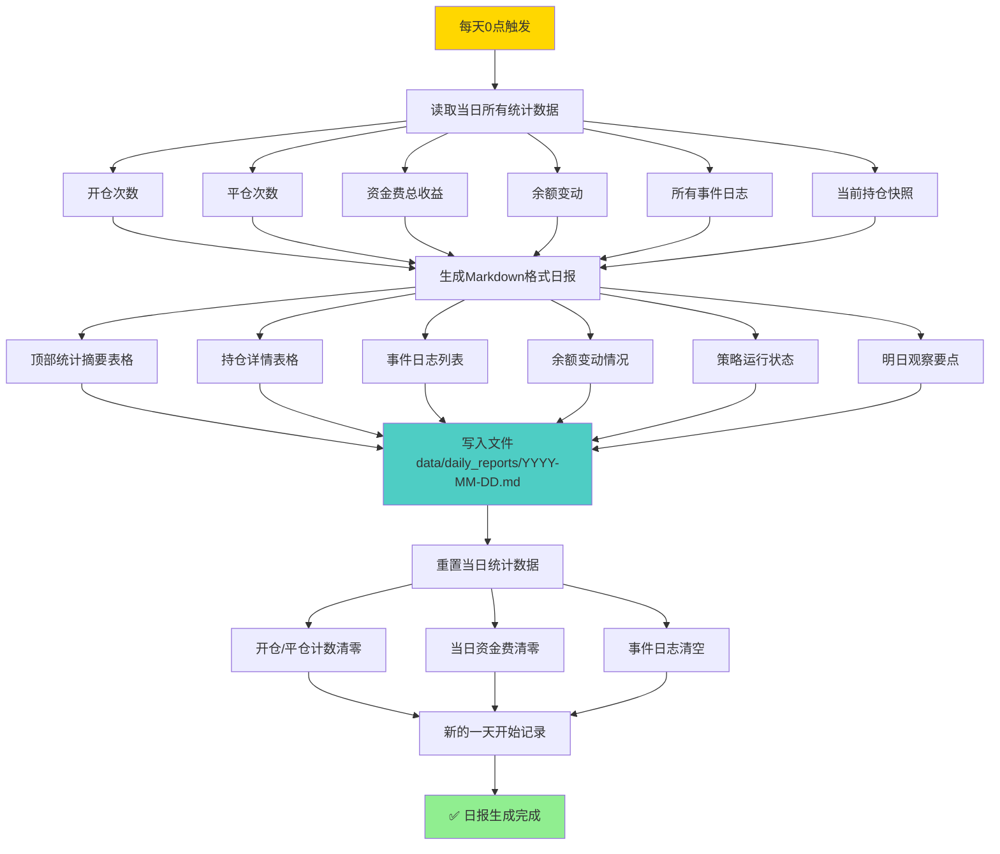

# 📊 资金费率套利机器人 - 完整交互流程图

> 🎯 目标：一张图看懂机器人运行的全流程，什么情况会发生什么，出了问题怎么处理

---

## 🟢 流程图1：主循环 - 正常运行全流程

这是机器人最核心的流程，每10分钟跑一次。



---

## 🛡️ 流程图2：风控触发 - 止损/止盈/熔断流程

8级风控体系是我们的生命线，这个流程决定了会不会亏大钱。

```mermaid
flowchart TD
    subgraph 【单次交易风控】
        A[每轮循环检查所有持仓] --> B{浮亏 >= 2%?}
        B -->|是| C[触发止损<br/>立即平仓]
        C --> D[日志记录 + 日报记录<br/>\"止损平仓: XXX\"]
        D --> E[连续亏损计数 + 1]
        
        B -->|否| F{浮盈 >= 3%?}
        F -->|是| G[触发止盈<br/>立即平仓]
        G --> H[日志记录 + 日报记录<br/>\"止盈平仓: XXX\"]
        H --> I[连续亏损计数清零]
        
        F -->|否| J{费率绝对值 < 0.02%?}
        J -->|是| K[费率太低不值得持有<br/>平仓]
        K --> L[日志记录 + 日报记录<br/>\"费率降低平仓: XXX\"]
        L --> M[连续亏损计数清零]
    end
    
    J -->|否| N[继续持有]
    
    subgraph 【全局风控熔断】
        E --> O{连续亏损 >= 3次?}
        I --> O
        M --> O
        
        O -->|是| P[⚠️ 触发熔断<br/>暂停交易24小时]
        P --> Q[飞书告警通知人工]
        Q --> R[日志记录 + 日报记录<br/>\"熔断: 连续亏损3次\"]
        
        O -->|否| S{当日总亏损 >= 500 USDT?}
        S -->|是| T[⚠️ 触发单日熔断<br/>全部平仓 + 暂停24小时]
        T --> Q
        
        S -->|否| U{最大回撤 >= 10%?}
        U -->|是| V[⚠️ 触发最大回撤熔断<br/>全部平仓 + 暂停3天]
        V --> Q
        
        U -->|否| W[风控正常<br/>继续运行]
    end
    
    N --> W
    
    style C fill:#FF6B6B
    style G fill:#4ECDC4
    style P fill:#FFB6C1
    style T fill:#FFB6C1
    style V fill:#FFB6C1
    style W fill:#90EE90
```

---

## 💰 流程图3：资金费结算流程（8小时一次）

这是我们的「发工资」流程，每天3次。

```mermaid
flowchart TD
    A[每轮循环检查时间] --> B{到了结算时间?<br/>UTC 0/8/16点}
    B -->|否| C[跳过]
    
    B -->|是| D[开始资金费结算]
    
    D --> E[遍历每个持仓]
    E --> F[获取当前费率]
    F --> G[计算本次资金费<br/>= 名义价值 × 费率]
    G --> H[更新累计收益]
    H --> I[记录到交易历史CSV]
    I --> J[📝 记录到日报<br/>\"XXX 资金费结算: +xx USDT\"]
    J --> K[更新该币种累计收益统计]
    
    K --> L{还有下一个持仓?}
    L -->|是| E
    L -->|否| M[持久化保存所有状态]
    
    M --> N[打印结算汇总日志]
    N --> O[仪表盘刷新收益数据]
    
    O --> P[✅ 本轮结算完成]
    
    style B fill:#FFD700
    style J fill:#90EE90
    style P fill:#90EE90
```

---

## 🔴 流程图4：异常处理 - API失败/网络中断

```mermaid
flowchart TD
    A[执行API调用<br/>下单/查余额等] --> B{调用成功?}
    B -->|是| C[正常继续]
    
    B -->|否| D[API调用失败]
    D --> E{失败次数 < 3次?}
    
    E -->|是| F[等待1秒<br/>指数退避重试]
    F --> A
    
    E -->|否| G[重试3次都失败]
    G --> H{是什么类型的操作?}
    
    H -->|读操作<br/>查费率/查余额| I[使用上次缓存的数据<br/>本轮跳过更新]
    I --> J[日志记录警告<br/>\"使用缓存数据\"]
    
    H -->|写操作<br/>下单/平仓| K[加入后台重试队列<br/>不阻塞主流程]
    K --> L[飞书告警通知人工<br/>\"下单失败，已加入重试队列\"]
    
    L --> M[重试管理器后台继续重试<br/>每5分钟试一次，最多10次]
    M --> N{重试成功?}
    N -->|是| O[同步状态<br/>日志记录\"重试成功\"]
    N -->|否| P{重试超过10次?}
    P -->|是| Q[紧急告警<br/>需要人工干预]
    P -->|否| M
    
    J --> R[继续主流程]
    O --> R
    Q --> R
    
    subgraph 【网络中断兜底方案】
        S[网络完全断开] --> T[程序继续运行<br/>所有状态保存在本地]
        T --> U[网络恢复后<br/>自动跟交易所同步状态]
        U --> V[对账确认一致<br/>继续正常运行]
    end
    
    style D fill:#FF6B6B
    style G fill:#FFB6C1
    style Q fill:#FF0000,color:#FFFFFF
    style S fill:#FF6B6B
    style V fill:#90EE90
```

---

## 🛡️ 流程图5：保证金守护线程（每30秒一次）

```mermaid
flowchart TD
    A[每30秒检查一次保证金] --> B[获取账户余额和持仓]
    B --> C[计算保证金率]
    
    C --> D{保证金率 <= 10%?}
    D -->|是| E[⚠️ 黄色预警<br/>飞书通知人工]
    D -->|否| F[安全，继续]
    
    E --> G{保证金率 <= 5%?}
    G -->|是| H[🔴 红色紧急预警]
    
    H --> I{是哪个交易所?}
    I -->|Binance| J[执行自动补保证金<br/>从现货账户转500 USDT]
    J --> K[飞书通知<br/>\"已自动补保证金500 USDT\"]
    K --> L[检查补后保证金率]
    
    I -->|OKX| M[⚠️ OKX不支持自动补<br/>立即通知人工手动补]
    M --> N[同时触发平仓保护<br/>平掉部分仓位降低风险]
    
    L --> O{补后仍然 <= 5%?}
    O -->|是| P[继续补<br/>最多补3次]
    O -->|否| Q[安全了]
    
    P --> R{补了3次还不够?}
    R -->|是| S[紧急全部平仓<br/>暂停交易]
    S --> T[电话/短信告警]
    
    R -->|否| Q
    N --> Q
    
    style D fill:#FFD700
    style G fill:#FF6B6B
    style J fill:#4ECDC4
    style S fill:#FF0000,color:#FFFFFF
    style Q fill:#90EE90
```

---

## 🖥️ 流程图6：Web仪表盘 - 人工干预流程

```mermaid
flowchart TD
    A[用户访问 http://localhost:8080] --> B[查看实时状态]
    
    B --> C[看到异常想干预]
    
    C --> D{点什么按钮?}
    
    D -->|暂停交易| E[设置暂停标志]
    E --> F[下一轮循环就不会开新仓了]
    F --> G[日志记录 + 日报记录<br/>\"人工暂停交易\"]
    
    D -->|恢复交易| H[清除暂停标志]
    H --> I[熔断计数不清零<br/>满足条件才允许开仓]
    I --> J[日志记录 + 日报记录<br/>\"人工恢复交易\"]
    
    D -->|一键平仓| K[立即执行全部平仓]
    K --> L[记录每笔平仓盈亏]
    L --> M[日志记录 + 日报记录<br/>\"人工一键平仓\"]
    M --> N[自动暂停交易]
    
    D -->|修改参数| O[修改阈值/仓位/止损等]
    O --> P[立即生效，不需要重启程序]
    P --> Q[日志记录 + 日报记录<br/>\"参数修改: XXX\"]
    
    G --> R[操作完成返回首页]
    J --> R
    Q --> R
    
    style R fill:#90EE90
```

---

## 📅 流程图7：每日日报生成流程（0点自动执行）



---

## 📋 附录：流程责任矩阵 - 哪些自动处理，哪些要人工

| 场景 | 处理方式 | 责任人 | 响应时间 |
|-----|---------|-------|---------|
| 正常开仓平仓 | ✅ 自动处理 | 机器人 | 实时 |
| 资金费结算 | ✅ 自动处理 | 机器人 | 结算窗口 |
| 止损止盈触发 | ✅ 自动处理 | 机器人 | 实时 |
| 熔断暂停交易 | ✅ 自动处理 + 📱 通知 | 机器人 + 人 | 实时 |
| API调用失败重试 | ✅ 自动处理 | 机器人 | 1秒后重试 |
| 保证金预警（<=10%） | ✅ 自动通知 | 机器人 + 人 | 30秒内 |
| 保证金紧急（<=5%） | Binance自动补 / OKX需人工 | 机器人 + 人 | 立即 |
| 连续重试10次失败 | 🔴 需要人工干预 | 人 | 30分钟内 |
| 程序崩溃退出 | 🔴 需要人工重启 | 人 | 1小时内 |

---

## 💡 看流程图的建议

1. **先看主循环流程** - 搞清楚机器人平时都在干什么
2. **重点看风控流程** - 这是防止你亏大钱的关键
3. **异常处理流程也要看** - 知道出了问题程序会怎么处理，什么时候需要你上
4. **最后看日报流程** - 知道每天的报告是怎么来的

---

**所有流程都设计了双重保险，关键节点都会通知到人。你不需要24小时盯盘，但收到告警要及时看一眼！** 🚀
